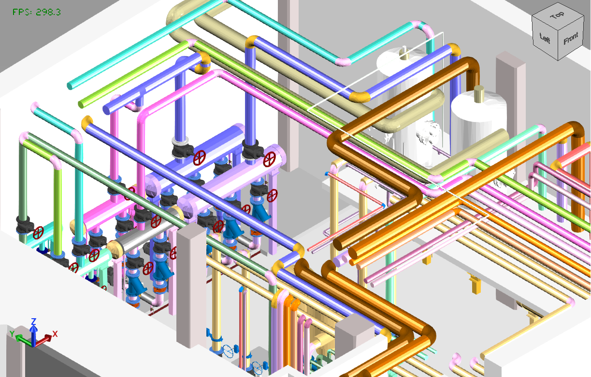

# MetroCIM

Revit **2025 / 2026 / 2027** add-in that exports the **active 3D view** to **glTF**, **XKT**, and **IFC**, using the colors you see on screen (view filters, graphic overrides, and MEP system types).



*Sample export of a mechanical room. Pipes, fittings, and accessories keep the same system colors as the Revit 3D view.*

## What it exports

The **MetroCIM** ribbon tab has an **Export** panel with three commands:

| Command | Output |
| --- | --- |
| **Export glTF** | `.glb` / `.gltf` from the active 3D view |
| **Export XKT** | `.xkt` for xeokit (writes a sibling `.glb` and `metadata.json`, then converts) |
| **Export IFC** | `.ifc` using a Revit IFC setup (in-session, built-in, or saved in the model) |

glTF and XKT include only what is visible in the current 3D view. IFC uses the selected Revit IFC setup; MetroCIM then applies the same system-type / view colors so piping matches glTF.

## Requirements

- Autodesk **Revit 2025**, **2026**, or **2027**
- For **Export XKT** only:
  - [Node.js](https://nodejs.org/)
  - `npm install -g @xeokit/xeokit-convert`

## Install

Build and copy the add-in into the Addins folder for your Revit year. Default is **2027**:

```bat
dotnet build src/MetroCIM/MetroCIM.csproj -p:DeployAddin=true
dotnet build src/MetroCIM/MetroCIM.csproj -p:RevitVersion=2026 -p:DeployAddin=true
dotnet build src/MetroCIM/MetroCIM.csproj -p:RevitVersion=2025 -p:DeployAddin=true
```

That writes (example for 2027):

- `%AppData%\Autodesk\Revit\Addins\2027\MetroCIM.addin`
- `%AppData%\Autodesk\Revit\Addins\2027\MetroCIM\MetroCIM.dll`

Use `2025` or `2026` in that path when you pass `-p:RevitVersion=2025` or `2026`. Fully quit Revit before installing (it locks the DLL). Then start Revit and use the **MetroCIM** tab.

## Use

1. Open a project and activate a **3D view** (glTF / XKT require this; IFC can use the active view).
2. Choose **Export glTF**, **Export XKT**, or **Export IFC**.
3. For IFC, pick a Revit IFC setup, then choose the output path.

If Node.js or xeokit-convert is missing, XKT export stops and shows the install command above.

## Build

```bat
dotnet build src/MetroCIM/MetroCIM.csproj
dotnet build src/MetroCIM/MetroCIM.csproj -p:RevitVersion=2026
dotnet build src/MetroCIM/MetroCIM.csproj -p:RevitVersion=2025
dotnet test src/MetroCIM.Tests/MetroCIM.Tests.csproj
```

| Revit | Target framework | API packages |
| --- | --- | --- |
| 2027 (default) | `net10.0-windows` | Nice3point Revit `2027.*` |
| 2026 | `net8.0-windows` | Nice3point Revit `2026.*` |
| 2025 | `net8.0-windows` | Nice3point Revit `2025.*` |

## Repository

https://github.com/metrocimcity-jpg/MetroCIM
